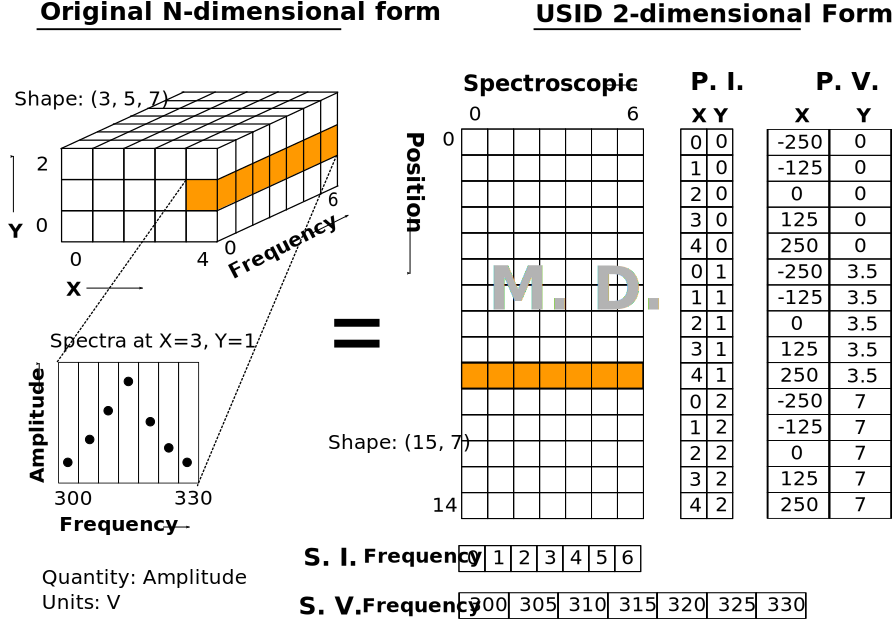

Data Schema
===========

**Suhas Somnath**

8/8/2017

In this main document we describe how imaging and spectroscopy data can be structured in the **Universal Spectroscopy and Imaging Data (USID)** schema.
We have a separate document on `specifications <./h5_usid.html>`_ that describes how this abstract data schema can be
incorporated and used in `hierarchical data format <./file_format.html>`_ (**HDF5**) files

`Alex Belianinonv <https://www.ornl.gov/staff-profile/alex-belianinov>`_ and
`Stephen Jesse <https://scholar.google.com/citations?user=uiTAx2cAAAAJ&hl=en>`_,
conceived the central theme of **USID** while Suhas Somnath and Chris R. Smith developed subsequent versions and refinements
of **USID** and developed the `specifications <./h5_usid.html>`_ for implementing **USID** in `HDF5 <./file_format.html>`_ files

.. contents::

Existing data schemas
---------------------
No one really wants yet another data schema or file format in their lives.
Like everyone else, we wanted to adopt a framework put together by other experts who had thought long and hard about the challenges.
We explored the feasibility of several data models and file formats from within and beyond imaging and microscopy.
However, in most cases, there were some important shortcomings which made it infeasible for us to adopt existing solutions.

Below, we list some of the many solutions we explored. In many cases, the data schema / model is tied very closely with the file format.
In general, we observed two basic kinds of existing data models:

#. **Text** - Most of these are markup language based:

   #. `Scanning Probe Microscopy Markup Language (SPMML) <https://aip.scitation.org/doi/pdf/10.1063/1.1639706>`_
   #. `MatML <https://www.matml.org/downloads/matml_data.pdf>`_
#. **Binary**

   #. HDF5-based

      #. `NeXus <https://www.ncbi.nlm.nih.gov/pmc/articles/PMC4453170/>`_
      #. `Data Exchange <https://pdfs.semanticscholar.org/1c12/fdeb6f428f73e5974da0f0f3aca6d09d163e.pdf>`_
      #. `Multidimensional eXtensible Archive (MXA) <http://iopscience.iop.org/article/10.1088/0965-0393/18/6/065008/meta>`_
      #. `Electron Microscopy Data (EMD) <https://emdatasets.com/format/>`_
      #. `PaNData <https://eudat.eu/sites/default/files/PaNdata_0.pdf>`_
      #. `Format used by HyperSpy <http://hyperspy.org/hyperspy-doc/current/user_guide/io.html#hspy-hyperspy-s-hdf5-specification>`_
      #. `Format used by DREAM.3D <https://link.springer.com/article/10.1186/2193-9772-3-5>`_
   #. Other

      #. `HMSA <https://www.microscopy.org/resources/HMSA_Specification.pdf>`_
#. **Image**

   #. OME-TIFF

Most of these models were designed rigidly around specific class of instruments, specific modalities, coordinate systems (Cartesian only with
no option for polar coordinates etc.), or for specific scientific communities such as the climate research, X-ray microscopy, etc.
We found models tied to plain-text-based file formats of data limiting, especially in the age of large multidimensional datasets.
While most of the data models tied to binary file formats can certainly represent the vast majority of data, we found all of them lacking
in one critically important area – none besides HMSA can represent large datasets without an N-dimensional form. Furthermore, most models
also assume experimental variables would only be varied in a linearly increasing or decreasing manner for all dimensions. Such models would
preclude the representation of those modalities where a variable was varied as a sine or a bipolar triangle. The closest and most general
model we found was the HMSA. While compromising user-friendliness for ultimate generalization is acceptable, the vulnerability of this model
is not – the potential separation or loss of the metadata file from the data file would render the dataset useless.

USID
----

Information in **USID** are stored in three main kinds of datasets:

#. ``Main`` datasets that contain the raw measurements recorded from
   the instrument as well as results from processing or analysis routines
   applied to the data
#. Mandatory ``Ancillary`` datasets that are necessary to explain the
   ``main`` data
#. ``Extra`` datasets store any other data that may be of value

In addition to datasets, the data schema is highly reliant on metadata that capture
smaller pieces but critical pieces of information such as the
``quantity`` and ``units`` that describe every data point in the ``main`` dataset.

**We acknowledge that this data schema is not trivial to understand at first glance but we are making every effort
to make is simple to understand. If you ever find anything complicated or unclear, please** `write to us <./contact.html>`_
**and we will improve our documentation.**

``Main`` Datasets
-----------------

Regardless of origin, modality or complexity, imaging data (and most scientific data for that matter) have one
thing in common:

**The same measurement / operation is performed at each spatial position**

The **USID** schema is based on this one simple ground-truth.
The data always has some ``spatial dimensions`` (X, Y, Z) and some
``spectroscopic dimensions`` (time, frequency, intensity, wavelength,
temperature, cycle, voltage, etc.). **In USID, the spatial
dimensions are collapsed onto a single dimension and the spectroscopic
dimensions are flattened into the second dimension.** Thus, all data are
stored as **two dimensional arrays**. The data would be arranged in the same manner that
reflects the sequence in which the individual data points were collected. Examples below
will simplify this data-representation paradigm significantly.

In general, if a measurement of length ``P`` was recorded for each of ``N`` positions,
it would be structured as shown in the table below here the prefixes ``i`` correspond to
the positions and ``j`` for spectroscopic:

+------------+------------+------------+--------+--------------+--------------+
| i0, j0     | i0, j1     | i0, j2     | <..>   | i0, jP-2     | i0, jP-1     |
+------------+------------+------------+--------+--------------+--------------+
| i1, j0     | i1, j1     | i1, j2     | <..>   | i1, jP-2     | i1, jP-1     |
+------------+------------+------------+--------+--------------+--------------+
| <......>   | <......>   | <......>   | <..>   | <........>   | <........>   |
+------------+------------+------------+--------+--------------+--------------+
| iN-2, j0   | iN-2, j1   | iN-2, j2   | <..>   | iN-2, jP-2   | iN-2, jP-1   |
+------------+------------+------------+--------+--------------+--------------+
| iN-1, j0   | iN-1, j1   | iN-1, j2   | <..>   | iN-1, jP-1   | iN-1, jP-1   |
+------------+------------+------------+--------+--------------+--------------+

A notion of chronology is attached to both the position and spectroscopic axes.
In other words, the data for the second location (second row in the above table)
was acquired after the first location (first row). The same applies to the spectroscopic axis as well.
This is an important point to remember especially when information is recorded
from multiple sources or channels (e.g. - data from different sensors) or if two or more numbers are **necessary** to
give a particular observation / data point its correct meaning (e.g. - color images).
This point will be clarified via examples that follow.

While the data could indeed be stored in the original N-dimensional form,
there are a few key **advantages to the 2D structuring**:

* The data is already of the **same structure expected by machine learning algorithms** and requires minimal
  to no pre-processing or post-processing. Briefly, the data is simply arranged in the standard form of ``instances x features``,
  where ``instances`` makes up the locations and ``features`` which contains all the observables per entry.
* In certain cases, the data simply **cannot be represented in an N-dimensional form** since one of the dimensions
  has multiple sizes in different contexts.
* Researchers want to acquire ever larger datasets that
  take much longer to acquire. This has necessitated approaches such as
  **sparse sampling** or `compressed sensing
  <https://en.wikipedia.org/wiki/Compressed_sensing>`__ wherein
  measurements are acquired from a few randomly sampled positions and the
  data for the rest of the positions are inferred using complex
  algorithms. Storing such sparse sampled data in the N dimensional form
  would balloon the size of the stored data even though the majority of the
  data is actually empty. Two dimensional datasets would allow the random
  measurements to be written without any empty sections.
* When acquiring measurement data, users often adjust experimental parameters
  during the experiment that may affect the size of the data, especially the
  spectral sizes. Thus, **changes in experimental parameters** would mean that the
  existing N dimensional set would have to be left partially (in most cases
  largely) empty and a new N dimensional dataset would have to be allocated
  with the first few positions left empty. In the case of flattened datasets,
  the current dataset can be truncated at the point of the parameter change
  and a new dataset can be created to start from the current measurement.
  Thus, no space would be wasted.

Here are some examples of how some familiar data can be represented using
this paradigm:

Spectrum
~~~~~~~~
.. image:: ./assets_USID/1D_spectra.svg

This case encompasses examples such as a **single** Raman spectrum, force-distance curve in
atomic force microscopy, current-voltage spectroscopy, etc. In this case, the measurement is recorded
at a single location meaning that this dataset has a single *arbitrary* ``position dimension``
of size 1. At this position, data is recorded as a
function of a single variable (``spectroscopic dimension``) such as *wavelength* or *frequency*.
Thus, if the spectrum contained ``S`` data points, the **USID** representation of this
data would be a ``1 x S`` matrix. The ``quantity`` represented in this data would be **Amplitude**.

.. note::
    After going through the corresponding discussion about ``Ancillary`` datasets, the interested reader is recommended to
    explore `this interactive example <./auto_examples/plot_1D_spectrum.html>`_ on actual data.

Gray-scale images
~~~~~~~~~~~~~~~~~
.. image:: ./assets_USID/2D_images.svg

In such data, a single value (``quantity`` is *intensity*) in is recorded
at each location in a two dimensional grid. Thus, there are are two
``position dimensions`` - *X*, *Y*. The value at each pixel was not really acquired
as a function of any variable so the data has one *arbitrary* ``spectroscopic dimension``.
Thus, if the image had ``P`` rows and ``Q`` columns, it would have to be flattened and
represented as a ``P*Q x 1`` array according to the **USID** schema. The second
axis has size of 1 since we only record one value (intensity) at each
location. In theory, the flattened data could be arranged column-by-column (as in the figure above)
and then row-by-row or vice-versa depending on how the data was (sequentially)
captured. The sequence in this particular case is debatable in this particular example.

.. note::
    After going through the corresponding discussion about ``Ancillary`` datasets, the interested reader is recommended to
    explore `this interactive example <./auto_examples/plot_2D_image.html>`_ on actual data.

Popular examples of such data include imaging data from raster scans (e.g. - height channel in atomic force microscopy),
black-and-white photographs, scanning electron microscopy (SEM) images. etc.

.. note::
    After going through the corresponding discussion about ``Ancillary`` datasets, the interested reader is recommended to
    explore `this interactive example <./auto_examples/plot_2D_image_stack.html>`_ on actual data.

Color images will be discussed separately below due to some very important subtleties about the
measurement.

Spectral maps
~~~~~~~~~~~~~

If a spectrum of length ``S`` were acquired at each location in a two dimensional grid of positions
with ``P`` rows and ``Q`` columns, it would result in a three dimensional dataset.
This example is a combination of the two examples above. The above 3D dataset has two
``position dimensions`` - *X* and *Y*, and has one ``spectroscopic dimension`` - *Frequency*.
Each data point in the dataset contains the same physical ``quantity`` - *Amplitude*.
In order to represent this 3D dataset in the 2D **USID** form, the two ``position dimensions``
in such data would need to be flattened along the vertical axis and the spectrum at each position
would be laid out along the horizontal axis or the spectroscopic axis.
Thus the original ``P x Q x S`` 3D array would be flattened to a 2D array of shape - ``P*Q x S``.
Assuming that the data was acquired column-by-column and then row-by-row, the rows in the flattened
2D dataset would also be laid out in the same manner: row\ :sub:`0`\ col\ :sub:`0`\ , row\ :sub:`0`\ col\ :sub:`1`\ , row\ :sub:`0`\ col\ :sub:`2`\ ,
... , row\ :sub:`0`\ col\ :sub:`Q`\ , row\ :sub:`1`\ col\ :sub:`0`\ , row\ :sub:`1`\ col\ :sub:`1`\ , ...

Popular examples of such datasets include Scanning Tunnelling Spectroscopy (STS) and
current-voltage spectroscopy

.. note::
    After going through the corresponding discussion about ``Ancillary`` datasets, the interested reader is recommended to
    explore `this interactive example <./auto_examples/plot_3D_spectral_image.html>`_ on actual data.

High dimensional data
~~~~~~~~~~~~~~~~~~~~~
This general representation for data was developed to express datasets with 7, 8, 9, or higher dimensional datasets.

The **spectral map** example above only had one ``spectroscopic dimension``. If spectra of length ``S`` were
acquired for ``T`` different *Temperatures*, the resultant dataset would have two ``spectroscopic dimensions`` -
*Frequency* and *Temperature* and would be of shape - ``P x Q x T x S``. Just as the two ``position dimensions``
were flattened along the vertical axis in the example above, now the two spectroscopic dimensions would also need
to be flattened along the horizontal axis. Thus the horizontal axis would be flattend as:
Temperature\ :sub:`0`\ Frequency\ :sub:`0`\ , Temperature\ :sub:`0`\ Frequency\ :sub:`1`\ ,Temperature\ :sub:`0`\ Frequency\ :sub:`2`\ , ...
, Temperature\ :sub:`0`\ Frequency\ :sub:`S`\ , Temperature\ :sub:`1`\ Frequency\ :sub:`0`\ , Temperature\ :sub:`1`\ Frequency\ :sub:`1`\ , ...
This four dimensional dataset would be flattened into a two dimensional array of shape ``P*Q x T*S``.

In the same manner, one could keep adding additional dimensions to either the position or spectroscopic axis.

Non Measurements
~~~~~~~~~~~~~~~~
This same flattened representation can also be applied to results of data analyses or
data that were not directly recorded from an instrument. Here are some examples:

-  A collection of ``k`` chosen spectra would also be considered
   ``Main`` datasets since the data is still structured as
   ``[instance, features]``
-  Similarly, the centroids obtained from a clustering algorithm like
   ``k-Means clustering``
-  The abundance maps obtained from decomposition algorithms like
   ``Singular Value Decomposition (SVD)`` or
   ``Non-negative matrix factorization (NMF)``

Complicated?
~~~~~~~~~~~~
This data schema may seem unnecessarily complicated for very simple / rigid data such as 2D images or 1D spectra.
However, bear in mind that **this paradigm was designed to represent any information regardless of dimensionality, origin, complexity**, etc.
Thus, encoding data in this manner will allow seamless sharing, exchange, and interpretation of data.

Compound Datasets
~~~~~~~~~~~~~~~~~
There are instances where multiple values are associate with a
single position and spectroscopic value in a dataset.  In these cases,
we use the `compound dataset functionality in HDF5 <https://support.hdfgroup.org/HDF5/Tutor/compound.html>`_
to store all of the
values at each point.  This also allows us to access any combination of
the values without needing to read all of them.  Pycroscopy actually uses
compound datasets a lot more frequently than one would think. The need
and utility of compound datasets are best described with examples:

* **Color images**: Each position in these datasets contain three (red,
  blue, green) or four (cyan, black, magenta, yellow) values. One would
  naturally be tempted to simply treat these datasets as ``N x 3`` or ``N x 4``
  datasets, (where ``N`` is the product of the number of *rows* and *columns*
  as in the gray-scale image example above) and it certainly is not wrong
  to represent data this way. However,
  storing the data in this manner would mean that the *red* intensity was
  collected first, followed by the *green*, and finally by the *blue*. In
  other words, **a notion of chronology is attached to both the position
  and spectroscopic axes** according to the **USID** definition.
  While the intensities for each color may be acquired sequentially in
  detectors, since we are not aware of the exact sequence we will assume
  that the *red*, *green*, and *blue* values are acquired simultaneously for
  simultaneously.

  In these cases, we store data using ``compound datasets``
  that allow the storage of multiple pieces of data within the same ``cell``.
  While this may seem confusing or implausible, remember that computers
  store complex numbers in the same way. The complex numbers have a *real*
  and an *imaginary* component just like color images have *red*, *blue*,
  and *green* components that describe a single pixel. Therefore, color
  images in the **USID** representation would be represented by a ``N x 1`` matrix with
  compound values instead of a ``N x 3`` matrix with real or integer values.
  For example, one would refer to the *red* component at a particular position as:

  .. code-block:: python

    red_value = dataset_name[position_index, spectroscopic_index]['red']

* **Functional fits**: Let's take the example of a dataset flattened to shape - ``N x P``,
  whose spectra at each location are fitted to a complicated equation. Now, the ``P``
  points in the spectra will be represented by ``S`` coefficients that don't
  necessarily follow any order. Consequently, the result of the functional
  fit should actually be a ``N x 1`` dataset where each element is a compound
  value made up of the ``S`` coefficients. Note that while some form of sequence
  can be forced onto the coefficients if the spectra were fit to polynomial
  functions, the benefits outweigh the drawbacks:

  * **Slicing**: Storing data in compound datasets circumvents problems associated
    with getting a specific / the ``kth`` coefficient if the data were stored in a
    real-valued matrix instead.
  * **Visualization** also becomes a lot simpler since compound datasets cannot
    be plotted without specifying the component / coefficient of interest. This
    avoids plots with alternating coefficients that are several orders of
    magnitude larger / smaller than each other.

While one could represent multiple channels of information simultaneously acquired by instruments
(for example - height, amplitude, phase channels in atomic force microscopy scan images) using compound datasets,
this is **not** the intended purpose of compound datasets. We use recommend storing each
channel of information separately for consistency across scientific disciplines.
For example, there are modalities in microscopy where some channels provide high
resolution topography data while others provide low-resolution but spectroscopy data.

For more information on compound datasets see the
`h5py Datasets documentation <http://docs.h5py.org/en/latest/high/dataset.html#reading-writing-data>`_
from the HDF Group.

Videos
~~~~~~
While USID provides an unambiguous and single solution for representing data, videos come into a gray area with two
plausible solutions rather than one. A video with ``S`` frames each containing an image of shape ``U x V`` can be
represented in USID either as a ``S x UV`` dataset or a ``UV x S`` dataset.

Those who strictly believe that the data for the ``N+1`` th observation (row in the USID ``Main`` dataset) is always
acquired after all the data for the ``N`` th observation (row in the USID ``Main`` dataset) may prefer the ``S x UV``
form. In other words, at time ``t = 0``, a 2D image of shape ``U x V`` is acquired. Subsequently, the next observation
is at time ``t = 1`` when another 2D image is acquired. The chronology of the observations (frames in the movie) are
indisputable. Thus, the data within each observation (``U x V`` image) would need to be flattened along the *horizontal*
axis per the examples above. The observations (frames in the movie) themselves would be stacked along the *vertical*
axis. This representation would confuse the reader since the ``Position`` and ``Spectroscopic`` dimensions are switched.
Here, the *physical* position dimensions of the camera sensor (``U`` and ``V``) would actually be the spectroscopic
dimensions in USID whereas time, which is typically a spectroscopic dimension in USID is treated as a Position dimension
instead. We believe that this would be the correct representation of a movie in USID.
We were very much aware of this potential problem and were originally planning on adopting the vocabulary used by the
data science community of ``Instance`` or ``Example`` and ``Features``. However, we realize that users not familiar
with this nomenclature may be confused.

Those who prefer to think of movies as maps of spectra may prefer the ``UV x S`` representation. However, the chronology
would be misrepresented or lost in such a USID representation. Nonetheless, such people may argue that this
representation is more in line with convention although it is at odds with the rules laid by USID.

The above philosophies would still hold true regardless of whether the data recorded at each time step were a 2D image,
a 1D spectrum or a N-dimensional hypercube.

``Ancillary`` Datasets
----------------------

So far we have explained how the (``main``) dataset of interest can be flattened and represented
regardless of its origin, size, dimensionality, etc. In order to make this
``main`` dataset **self-explanatory**, additional pieces of information are required.
For example, while the ``main`` dataset preserves the data of interest, information regarding the
original dimensionality of the data or the combination of parameters corresponding to each
observation is not captured.

In order to capture such vital information, each ``main`` dataset is always accompanied by
**four** ``ancillary`` datasets. These are the:

* The ``Position Values`` and ``Position Indices`` that describe the index and
  value of any given row or spatial position in the ``main`` dataset.
* The ``Spectroscopic Values`` and ``Spectroscopic Indices`` that describe the
  index and values all columns in the ``main`` dataset for all spectroscopic dimensions.

The pair of ``Values`` datasets are analogous to legends for maps. In other words, the pair of
``Values`` datasets **provide the combination of the values for each dimension** / variable
that correspond to a particular data point in the ``main`` dataset. For example, one
would be able to understand readily that a particular data point in the ``main`` dataset
was acquired for the reference values of *Frequency* of 315 kHz, *Temperature* of 400 K
from the ``Spectroscopic Values`` dataset and location *X* of 7.125 microns and *Y* of
480 nanometers from the ``Position Values`` dataset.

The pair of ``Indices`` datasets are essentially **counters for each position
and spectroscopic dimension** / variable. Continuing the example presented for the ``Values``
datasets, let's assume that the data was acquired as a function of all unique combinations of
``37`` *Frequency* values, ``12`` *Temperatures*, ``64`` locations in the *X* direction
and ``128`` values in the *Y* direction. Then, the ``Spectroscopic Indices`` dataset would
instruct that the given data point in the ``main`` dataset corresponds to the ``13th``
*Frequency* value and ``5th`` *Temperature* value. In the same way, the ``Position Indices``
dataset would show that the data point of interest corresponds to the ``47th`` value of *X*
and ``106th`` value of *Y*.

The pair of ``Indices`` datasets are critical for explaining:

* the original dimensionality of the dataset
* how to reshape the data back to its N dimensional form

Much like ``main`` datasets, the ``ancillary`` datasets are also two
dimensional matrices regardless of the number of ``position`` or
``spectroscopic dimensions``. Given a ``main`` dataset with ``N`` positions,
each containing ``P`` spectral values (shape = (``N x P``)), and having
``U`` ``position dimensions`` and  ``V`` ``spectroscopic dimensions``:

* The ``Position Indices`` and ``Position Values`` datasets would both of the
  same size of ``N x U``, where ``U`` is the number of ``position
  dimensions``. The **columns would be arranged in descending order of rate of
  change**. In other words, the first column would be the fastest changing
  position dimension and the last column would be the slowest. **Each position dimension gets it's own column**.

* The ``Spectroscopic Values`` and ``Spectroscopic Indices`` dataset would
  both be ``V x P`` in shape, where ``V`` is the number of ``spectroscopic
  dimensions``. Similarly to the ``position dimensions``, the first row would be
  the fastest changing ``spectroscopic dimension`` while the last row would be
  the slowest varying dimension. **Each spectroscopic dimension gets it's own row**.

The ``ancillary`` datasets are better illustrated via a few examples. We will
be continuing with the same examples used when illustrating the ``main`` dataset.

Spectrum
~~~~~~~~
Let's assume that data points were collected as a function of 5 values of the (sole) variable / ``spectroscopic dimension`` -
*Frequency*.  In that case, the ``Spectroscopic Values`` dataset would be of size ``1 x 5`` (one row for the single
``spectroscopic dimension`` and eight columns for each of the reference *Frequency* steps.
Let's assume that the data was collected as a function of *Frequency* over a band ranging from ``300`` to ``320`` kHz.
In that case, the ``Spectroscopic Values`` would be as shown below:

+---------------+-----+-----+-----+-----+-----+
| **Frequency** | 300 | 305 | 310 | 315 | 320 |
+---------------+-----+-----+-----+-----+-----+

This means that for all positions in the ``main`` dataset, the ``4th`` column would always correspond to data collected
for the *Frequency* of ``315 kHz``.

As the name suggests, the ``Spectroscopic Indices`` dataset only shows the indices for the steps in the dimension.
In this particular case, the dataset is trivial and just a linearly increasing array.

Note that indices start from ``0`` instead of ``1`` and
end at ``5-1`` instead of ``5`` in line with common programming languages such as *C* or *python* as shown below:

+---------------+-----+-----+-----+-----+-----+
| **Frequency** | 0   | 1   | 2   | 3   | 4   |
+---------------+-----+-----+-----+-----+-----+

Given that the spectrum only had a single *arbitrary* ``position dimension`` which was varied over a single (arbitrary)
value, the ``Position Indices`` and ``Position Values`` datasets would have a shape of ``1 x 1``.

``Position Indices``:

+----------+
| **arb.** |
+==========+
| 0        |
+----------+

``Position Values``:

+----------+
| **arb.** |
+==========+
| 0.0      |
+----------+

.. note::
    The interested reader is recommended to explore
    `this interactive example <./auto_examples/plot_1D_spectrum.html>`_ on actual data.

Gray-scale image
~~~~~~~~~~~~~~~~
A simple gray-scale image with ``X`` pixels in the horizontal and ``Y`` pixels in the vertical
direction would have ancillary position
datasets of shape ``X*Y x 2``. The first column in the ancillary position
datasets would correspond to the index / values of the dimension - ``X``
(assuming that it is the dimension that varies fastest)
and the second column in the ancillary position dataset would be the dimension - ``Y``
assuming that the data was collected column-by-column and then row-by-row just as in the example above.

If the original image had 3 pixels in the horizontal direction and 2 pixels in the vertical direction,
the corresponding ``Position Indices`` dataset would be:

+-------+-----+
|   X   | Y   |
+=======+=====+
| 0     | 0   |
+-------+-----+
| 1     | 0   |
+-------+-----+
| 2     | 0   |
+-------+-----+
| 0     | 1   |
+-------+-----+
| 1     | 1   |
+-------+-----+
| 2     | 1   |
+-------+-----+

Notice that the index for ``X`` is reset to ``0`` when ``Y`` is incremented from ``0`` to ``1`` in the fourth row.
As mentioned earlier, the data in such ``Indices`` datasets are essentially counters.

Correspondingly, if the measurements were performed at ``X`` locations:
``0.0, 1.5, and 3.0`` *microns* and ``Y`` locations: ``-70`` and ``23`` *nanometers*,
the ``Position Values`` dataset may look like the table below:

+----------+-----------+
| X        | Y         |
+==========+===========+
| 0.0      | -70.0     |
+----------+-----------+
| 1.5      | -70.0     |
+----------+-----------+
| 3.0      | -70.0     |
+----------+-----------+
| 0.0      | 23.0      |
+----------+-----------+
| 1.5      | 23.0      |
+----------+-----------+
| 3.0      | 23.0      |
+----------+-----------+

Thus, the ``5th`` row in the ``main dataset`` for this gray-scale image would correspond to data collected
at ``X = 1.5 microns`` and ``Y = 23 nanometers`` according to the ``Position Values`` dataset.

Note that ``X`` and ``Y`` dimensions have **different units** - microns and nanometers.
Pycroscopy has been designed to handle variations in the units for
each of these dimensions. Details regarding how and where to store
the information regarding the ``labels`` ('X', 'Y') and ``units`` for
these dimensions ('um', 'nm') will be discussed in the ``Implementation`` section.

Similar to the ``position dimensions`` for a spectrum, gray-scale images only have a single *arbitrary*
``spectroscopic dimension``. Thus, both ``Spectroscopic`` datasets have shape of ``1 x 1``:

``Spectroscopic Indices``:

+-----------+-----+
| **arb.**  | 0   |
+-----------+-----+

``Spectroscopic Values``:

+-----------+-----+
| **arb.**  | 0   |
+-----------+-----+

.. note::
    The interested reader is recommended to
    explore `this interactive example <./auto_examples/plot_2D_image.html>`_ on actual data.

Spectral maps
~~~~~~~~~~~~~
Let's continue the example on **spectral maps**, which has two ``position
dimensions`` - *X* and *Y*, and one ``spectroscopic dimension`` - *Frequency*.
If the dataset was varied over ``3`` values of *X*, ``2`` values of *Y* and ``5`` values of *Frequency*, the
``ancillary`` datasets would be based on the solutions for the two examples above:

``Position Indices``:

+-------+-----+
|   X   | Y   |
+=======+=====+
| 0     | 0   |
+-------+-----+
| 1     | 0   |
+-------+-----+
| 2     | 0   |
+-------+-----+
| 0     | 1   |
+-------+-----+
| 1     | 1   |
+-------+-----+
| 2     | 1   |
+-------+-----+

``Position Values``:

+----------+-----------+
| X        | Y         |
+==========+===========+
| 0.0      | -70.0     |
+----------+-----------+
| 1.5      | -70.0     |
+----------+-----------+
| 3.0      | -70.0     |
+----------+-----------+
| 0.0      | 23.0      |
+----------+-----------+
| 1.5      | 23.0      |
+----------+-----------+
| 3.0      | 23.0      |
+----------+-----------+

``Spectroscopic Indices``:

+---------------+-----+-----+-----+-----+-----+
| **Frequency** | 0   | 1   | 2   | 3   | 4   |
+---------------+-----+-----+-----+-----+-----+

``Spectroscopic Values``:

+---------------+-----+-----+-----+-----+-----+
| **Frequency** | 300 | 305 | 310 | 315 | 320 |
+---------------+-----+-----+-----+-----+-----+

.. note::
    The interested reader is recommended to
    explore `this interactive example <./auto_examples/plot_3D_spectral_image.html>`_ on actual data.

High dimensional data
~~~~~~~~~~~~~~~~~~~~~
Continuing with the expansion of the **spectral maps** example - if the data was recorded as a function of ``3``
*Temperatures* in addition to recording data as a function of *Frequency* as in the above example, we wold have two
``spectroscopic dimensions`` - *Frequency*, and *Temperature*. Thus, the ``ancillary spectroscopic`` datasets would
now have a shape of ``2 x 5*3`` instead of the simpler ``1 x 5``. The value ``2`` on the first index corresponds to
the two ``spectroscopic dimensions`` and the longer (``15`` instead of ``5``) second axis corresponds to the fact
that the spectra is now recorded thrice at each *Temperature* (once for each *Frequency*). Assuming that the *Frequency*
varies faster than the *Temperature* dimension (i.e.- the *Frequency* is varied from ``300`` to ``320`` for a
*Temperature* of ``30 C``, **then** the *Frequency* is varied from ``300`` to ``320`` for a *Temperature* of ``40 C``
and so on), the ``Spectroscopic Indices`` would be as follows:

+-----------------+-----+-----+-----+-----+-----+-----+-----+-----+-----+-----+-----+-----+-----+-----+-----+
| **Frequency**   | 0   | 1   | 2   | 3   | 4   | 0   | 1   | 2   | 3   | 4   | 0   | 1   | 2   | 3   | 4   |
+-----------------+-----+-----+-----+-----+-----+-----+-----+-----+-----+-----+-----+-----+-----+-----+-----+
| **Temperature** | 0   | 0   | 0   | 0   | 0   | 1   | 1   | 1   | 1   | 1   | 2   | 2   | 2   | 2   | 2   |
+-----------------+-----+-----+-----+-----+-----+-----+-----+-----+-----+-----+-----+-----+-----+-----+-----+

Correspondingly, the ``Spectroscopic Values`` would look like:

+-----------------+-----+-----+-----+-----+-----+-----+-----+-----+-----+-----+-----+-----+-----+-----+-----+
| **Frequency**   | 300 | 305 | 310 | 315 | 320 | 300 | 305 | 310 | 315 | 320 | 300 | 305 | 310 | 315 | 320 |
+-----------------+-----+-----+-----+-----+-----+-----+-----+-----+-----+-----+-----+-----+-----+-----+-----+
| **Temperature** | 30  | 30  | 30  | 30  | 30  | 40  | 40  | 40  | 40  | 40  | 50  | 50  | 50  | 50  | 50  |
+-----------------+-----+-----+-----+-----+-----+-----+-----+-----+-----+-----+-----+-----+-----+-----+-----+

Since the manner and values over which the positions are varied remains unchanged from the *spectral maps* example,
the ``Position Indices`` and ``Position Values`` datasets for this example would be identical those of the *spectral maps* example

A simple glance at the shape of the ``ancillary`` datasets for this (or any) example would be enough to
reveal that the data has two ``position dimensions`` (two columns in the ``Position Indices`` dataset) and
two ``spectroscopic dimensions`` (two rows in the ``Spectroscopic Indices`` dataset)
dataset)

In the same manner, additional dimensions can be added to the ``main`` and appropriate ``ancillary`` datasets
thus proving that this data schema can indeed accommodate data of any size, complexity, or dimensionality.

Channels
--------
The **USID** schema also allows the representation and capture of **information acquired
simultaneously from multiple sources** through ``Channels``.
Each ``Channel`` would contain a **separate** ``main`` dataset. ``Ancillary`` datasets
can be shared across channels if the position or spectroscopic dimensions are identical.

As alluded to earlier, the most popular example many people can relate to are the various channels
of information recorded during a conventional scanning probe microscopy raster scan (*Height*, *Amplitude*, *Phase*).
For this example, all the ``channels`` could share the same set of four ``ancillary`` datasets.

It is not necessary that rate of acquisition match across ``channels``. For example, one
``channel`` could be a high-resolution topography scan (similar to 2D gray-scale image)
while another ``channel`` could contain spectra collected at each location on a
**coarser** grid of positions (3D spectral-map dataset). In this case, the two
``channels`` may not be able to share ``ancillary`` datasets.

Specifics regarding the implementation of different
channels will be discussed in a later section.